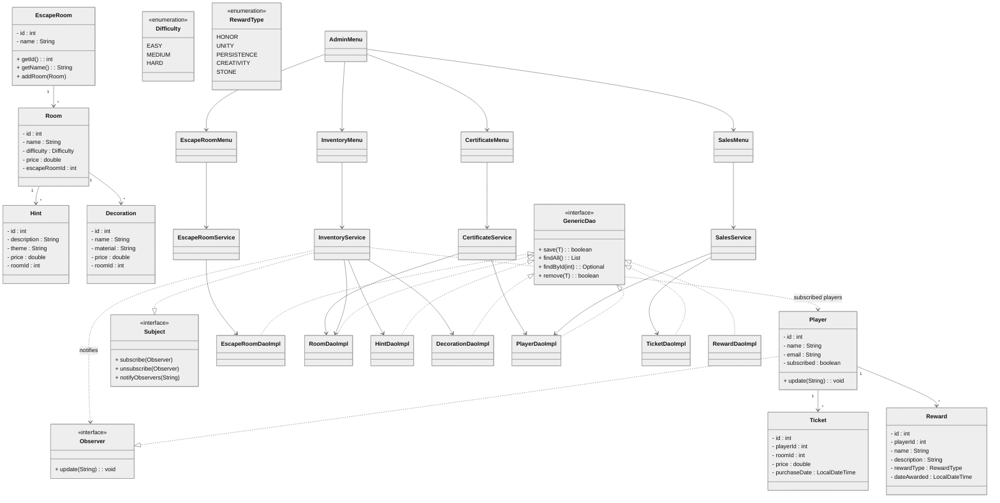

# 🧩 Escape Room Management System

---

## 📄 Description – Exercise Statement

This project consists of building a **console-based management system** for an Escape Room business.  
It allows administrators to manage escape rooms, rooms, hints, and decorations, while players receive automatic notifications when new events are created.

The goal of the exercise is to apply **Object-Oriented Programming (OOP)** principles, database integration through **JDBC**, and implement the **Observer design pattern** to simulate event-driven updates.

Developed as part of the **Java Back-End Development Bootcamp** at *IT Academy Barcelona*.

---
### 🎯 Key Features

- [X] Create a new Escape Room with a unique name
- [X] Add a new room with its respective difficulty level
- [X] Incorporate thematic clues to enrich the gaming experience
- [X] Introduce decorative objects to create a unique atmosphere in the rooms
- [X] Show the updated inventory, displaying the available quantities of each element (rooms, hints, and decorative objects)
- [X] View the total value in euros of the virtual Escape Room inventory
- [X] Allow the removal of rooms, hints, or decorative objects from the inventory
- [X] Offer functionality to issue certificates for completing puzzles, recording player achievements during their Escape Room experience
- [X] Provide possible gifts or rewards in recognition of players' skills and problem-solving ability
- [X] Generate sales tickets for the different players
- [X] Calculate and display the total revenue generated from ticket sales for the virtual Escape Room
- [X] Notify users about important events in the Escape Room, such as the addition of new rooms or the creation of a new Escape Room
- [X] Allow users to register to receive notifications when relevant events occur

---
### 💾 Database Schema Overview

Below is the database structure for the Escape Room system:


---
## 🧩 UML Diagram



---

## 💻 Technologies Used

| Category | Tools / Technologies |
|-----------|----------------------|
| **Language** | Java 21 |
| **Database** | MySQL 8 |
| **Persistence** | JDBC |
| **Build Tool** | Maven |
| **Containerization** | Docker & Docker Compose |
| **Testing** | JUnit 5, AssertJ |
| **IDE** | IntelliJ IDEA |
| **Version Control** | Git & GitHub |

---

## 📋 Requirements

Before running this project, ensure you have installed:

- ☕ **Java JDK 21**
- 🧱 **Apache Maven 3.9+**
- 🐳 **Docker Desktop** (or Docker Engine + Docker Compose)
- 🗄️ **MySQL 8.0+**
- 🧰 IDE such as IntelliJ IDEA or VS Code (optional but recommended)

---

## 🛠️ Installation

### 1️⃣ Clone the repository
```bash
git clone https://github.com/Escape-Room-ITAcademy-Oct2025/EscapeRoom.git
cd EscapeRoom
```

### 2️⃣ Start the MySQL container using Docker
```bash
cd docker
docker compose up -d
```

This will start:
- **MySQL** on port `3307`

### 3️⃣ Verify that the database is loaded

The script [`docker/init/init.sql`](docker/init/init.sql) automatically creates:
- Tables (`escape_room`, `room`, `hint`, `decoration`, `player`, `ticket`, `reward`)
- Sample records for initial testing

---

## ▶️ Execution

### Option 1 – Run via IntelliJ IDEA
1. Open the project as a Maven project.
2. Ensure the database container is running.
3. Run the `Main` class.
4. Follow the on-screen menu to manage Escape Rooms, Rooms, and other entities.

### Option 2 – Run from the terminal
```bash
mvn clean compile exec:java
```

### Option 3 – Execute tests
```bash
mvn test
```
---

### 🧑‍💻 Authors

- [**Adrià Lorente**](https://github.com/alaw810)
- [**Andrés Calvo**](https://github.com/Andrescalvo22)

Developed at [IT Academy Barcelona](https://www.barcelonactiva.cat/itacademy)  
as part of the **Java Back-End Development Bootcamp** (2025).